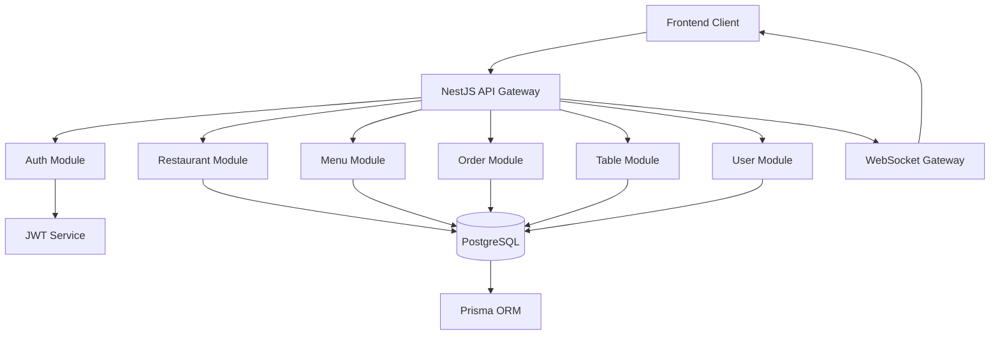

# Design Document

## Overview

El backend del sistema de pedidos para restaurantes será desarrollado como una API REST usando NestJS con TypeScript, PostgreSQL como base de datos y Prisma como ORM. El sistema permitirá mostrar el menú mediante códigos QR públicos y realizar pedidos desde tablets fijas. Implementará autenticación JWT, WebSockets para comunicación en tiempo real, y una arquitectura modular que permita escalabilidad futura para múltiples idiomas.

## Architecture

### Technology Stack
- **Framework**: NestJS con TypeScript
- **Base de datos**: PostgreSQL
- **ORM**: Prisma
- **Autenticación**: JWT (JSON Web Tokens)
- **Tiempo real**: Socket.IO
- **Hosting**: Railway/Render/DigitalOcean/AWS

### High-Level Architecture



### Module Structure
```
src/
├── app.module.ts
├── main.ts
├── auth/
│   ├── auth.module.ts
│   ├── auth.service.ts
│   ├── auth.controller.ts
│   ├── jwt.strategy.ts
│   └── guards/
├── restaurants/
│   ├── restaurants.module.ts
│   ├── restaurants.service.ts
│   ├── restaurants.controller.ts
│   └── dto/
├── menu/
│   ├── menu.module.ts
│   ├── menu.service.ts
│   ├── menu.controller.ts
│   └── dto/
├── orders/
│   ├── orders.module.ts
│   ├── orders.service.ts
│   ├── orders.controller.ts
│   └── dto/
├── tables/
│   ├── tables.module.ts
│   ├── tables.service.ts
│   ├── tables.controller.ts
│   └── dto/
├── users/
│   ├── users.module.ts
│   ├── users.service.ts
│   ├── users.controller.ts
│   └── dto/
├── websocket/
│   ├── websocket.module.ts
│   └── websocket.gateway.ts
├── common/
│   ├── guards/
│   ├── decorators/
│   ├── filters/
│   └── interceptors/
└── prisma/
    ├── schema.prisma
    └── migrations/
```

## Components and Interfaces

### Database Schema (Prisma)

```prisma
model Restaurant {
  id          String   @id @default(cuid())
  name        String
  description String?
  createdAt   DateTime @default(now())
  updatedAt   DateTime @updatedAt
  
  // Relations
  tables        Table[]
  menuItems     MenuItem[]
  categories    Category[]
  orders        Order[]
  users         User[]
}

model Language {
  id   String @id @default(cuid())
  code String @unique // es, en, fr
  name String // Español, English, Français
  
  // Relations
  menuItemTranslations MenuItem_Translation[]
  categoryTranslations Category_Translation[]
}

model Category {
  id           String   @id @default(cuid())
  name         String   // Default Spanish name
  description  String?  // Default Spanish description
  sortOrder    Int      @default(0)
  restaurantId String
  restaurant   Restaurant @relation(fields: [restaurantId], references: [id])
  createdAt    DateTime @default(now())
  updatedAt    DateTime @updatedAt
  
  // Relations
  menuItems    MenuItem[]
  translations Category_Translation[]
}

model Category_Translation {
  id          String   @id @default(cuid())
  categoryId  String
  languageCode String
  name        String
  description String?
  
  category    Category @relation(fields: [categoryId], references: [id])
  language    Language @relation(fields: [languageCode], references: [code])
  
  @@unique([categoryId, languageCode])
}

model MenuItem {
  id           String   @id @default(cuid())
  name         String   // Default Spanish name
  description  String?  // Default Spanish description
  price        Decimal  @db.Decimal(10,2)
  available    Boolean  @default(true)
  sortOrder    Int      @default(0)
  restaurantId String
  categoryId   String
  restaurant   Restaurant @relation(fields: [restaurantId], references: [id])
  category     Category   @relation(fields: [categoryId], references: [id])
  createdAt    DateTime   @default(now())
  updatedAt    DateTime   @updatedAt
  
  // Relations
  translations MenuItem_Translation[]
  orderItems   OrderItem[]
}

model MenuItem_Translation {
  id           String   @id @default(cuid())
  menuItemId   String
  languageCode String
  name         String
  description  String?
  
  menuItem     MenuItem @relation(fields: [menuItemId], references: [id])
  language     Language @relation(fields: [languageCode], references: [code])
  
  @@unique([menuItemId, languageCode])
}

model Table {
  id           String      @id @default(cuid())
  number       String
  status       TableStatus @default(AVAILABLE)
  restaurantId String
  restaurant   Restaurant  @relation(fields: [restaurantId], references: [id])
  createdAt    DateTime    @default(now())
  updatedAt    DateTime    @updatedAt
  
  // Relations
  orders       Order[]
  
  @@unique([restaurantId, number])
}

enum TableStatus {
  AVAILABLE
  OCCUPIED
  RESERVED
  OUT_OF_SERVICE
}

model Order {
  id           String      @id @default(cuid())
  orderNumber  String      @unique
  status       OrderStatus @default(PENDING)
  totalAmount  Decimal     @db.Decimal(10,2)
  notes        String?
  restaurantId String
  tableId      String
  restaurant   Restaurant  @relation(fields: [restaurantId], references: [id])
  table        Table       @relation(fields: [tableId], references: [id])
  createdAt    DateTime    @default(now())
  updatedAt    DateTime    @updatedAt
  
  // Relations
  orderItems   OrderItem[]
}

enum OrderStatus {
  PENDING
  CONFIRMED
  IN_PREPARATION
  READY
  DELIVERED
  CANCELLED
}

model OrderItem {
  id         String   @id @default(cuid())
  quantity   Int
  unitPrice  Decimal  @db.Decimal(10,2)
  totalPrice Decimal  @db.Decimal(10,2)
  notes      String?
  orderId    String
  menuItemId String
  order      Order    @relation(fields: [orderId], references: [id])
  menuItem   MenuItem @relation(fields: [menuItemId], references: [id])
  createdAt  DateTime @default(now())
}

model User {
  id           String   @id @default(cuid())
  email        String   @unique
  password     String
  firstName    String
  lastName     String
  role         UserRole
  isActive     Boolean  @default(true)
  restaurantId String
  restaurant   Restaurant @relation(fields: [restaurantId], references: [id])
  createdAt    DateTime @default(now())
  updatedAt    DateTime @updatedAt
}

enum UserRole {
  ADMIN
  MANAGER
  KITCHEN
  WAITER
}
```

### Core Services

#### AuthService
- JWT token generation and validation
- User authentication and authorization
- Role-based access control
- Password hashing and verification

#### RestaurantService
- Restaurant CRUD operations
- Restaurant configuration
- QR code generation for menu display

#### MenuService
- Menu item and category management
- Multi-language structure (ready for future expansion)
- Price and availability management
- Public menu access for QR codes

#### OrderService
- Order creation and management
- Order status updates
- Order number generation
- Table-order association

#### TableService
- Table management and status tracking
- Table selection for orders
- Table status updates

#### WebSocketService
- Real-time order notifications
- Status update broadcasts
- Client connection management

### API Endpoints

#### Authentication
```
POST /auth/login
POST /auth/refresh
POST /auth/logout
```

#### Restaurants
```
GET    /restaurants/:id
PUT    /restaurants/:id
GET    /restaurants/:id/qr-menu
```

#### Menu
```
GET /restaurants/:id/menu
GET /restaurants/:id/categories
POST /restaurants/:id/categories
PUT /restaurants/:id/categories/:categoryId
DELETE /restaurants/:id/categories/:categoryId
GET /restaurants/:id/menu-items
POST /restaurants/:id/menu-items
PUT /restaurants/:id/menu-items/:itemId
DELETE /restaurants/:id/menu-items/:itemId
```

#### Tables
```
GET    /restaurants/:id/tables
POST   /restaurants/:id/tables
PUT    /restaurants/:id/tables/:tableId
DELETE /restaurants/:id/tables/:tableId
```

#### Orders
```
POST   /restaurants/:id/orders
GET    /restaurants/:id/orders
GET    /restaurants/:id/orders/:orderId
PUT    /restaurants/:id/orders/:orderId/status
GET    /orders/:orderNumber
```

#### Users
```
GET    /restaurants/:id/users
POST   /restaurants/:id/users
PUT    /restaurants/:id/users/:userId
DELETE /restaurants/:id/users/:userId
```

## Data Models

### DTOs (Data Transfer Objects)

#### CreateOrderDto
```typescript
export class CreateOrderDto {
  @IsString()
  tableId: string;

  @IsArray()
  @ValidateNested({ each: true })
  @Type(() => OrderItemDto)
  items: OrderItemDto[];

  @IsOptional()
  @IsString()
  notes?: string;
}

export class OrderItemDto {
  @IsString()
  menuItemId: string;

  @IsInt()
  @Min(1)
  quantity: number;

  @IsOptional()
  @IsString()
  notes?: string;
}
```

#### MenuResponseDto
```typescript
export class MenuResponseDto {
  categories: CategoryWithItemsDto[];
}

export class CategoryWithItemsDto {
  id: string;
  name: string;
  description?: string;
  sortOrder: number;
  items: MenuItemDto[];
}

export class MenuItemDto {
  id: string;
  name: string;
  description?: string;
  price: number;
  available: boolean;
  sortOrder: number;
}
```

## Error Handling

### Custom Exception Filters
- Global exception filter for consistent error responses with i18n support
- Validation exception filter for DTO validation errors
- Database exception filter for Prisma errors
- I18n exception filter for localized error messages

### Error Response Format
```typescript
{
  statusCode: number;
  message: string | string[];
  error: string;
  timestamp: string;
  path: string;
  language?: string; // For future multi-language support
}
```

### Internationalization for Errors
- Error messages will be stored in translation files (initially Spanish only)
- Structure prepared for multiple languages: `errors/es.json`, `errors/en.json`
- Error keys will be used internally, translated messages returned to client
- Fallback to Spanish for missing translations

### Error Translation Structure
```typescript
// errors/es.json
{
  "auth": {
    "invalid_credentials": "Credenciales inválidas",
    "token_expired": "Token expirado",
    "insufficient_permissions": "Permisos insuficientes"
  },
  "orders": {
    "table_not_found": "Mesa no encontrada",
    "menu_item_unavailable": "Producto no disponible",
    "invalid_order_data": "Datos del pedido inválidos"
  },
  "validation": {
    "required_field": "Este campo es requerido",
    "invalid_format": "Formato inválido"
  }
}
```

### Common Error Scenarios
- **401 Unauthorized**: Invalid JWT token or expired session
- **403 Forbidden**: Insufficient permissions for requested action
- **404 Not Found**: Resource not found (restaurant, table, order, etc.)
- **400 Bad Request**: Invalid order data or malformed request
- **409 Conflict**: Duplicate resource creation attempts
- **422 Unprocessable Entity**: Business logic validation failures

## Testing Strategy

### Unit Testing
- Service layer testing with mocked dependencies
- Controller testing with mocked services
- Utility function testing
- JWT strategy testing

### Integration Testing
- Database integration tests with test database
- API endpoint testing with supertest
- WebSocket connection testing
- Authentication flow testing

### E2E Testing
- Complete order flow testing
- Multi-user role testing
- Real-time notification testing
- QR menu access testing

### Test Structure
```
test/
├── unit/
│   ├── services/
│   ├── controllers/
│   └── utils/
├── integration/
│   ├── database/
│   ├── api/
│   └── websocket/
└── e2e/
    ├── order-flow.e2e-spec.ts
    ├── auth-flow.e2e-spec.ts
    └── realtime.e2e-spec.ts
```

### Testing Tools
- **Jest**: Unit and integration testing framework
- **Supertest**: HTTP assertion library for API testing
- **Test Containers**: Database testing with Docker containers
- **Socket.IO Client**: WebSocket testing utilities